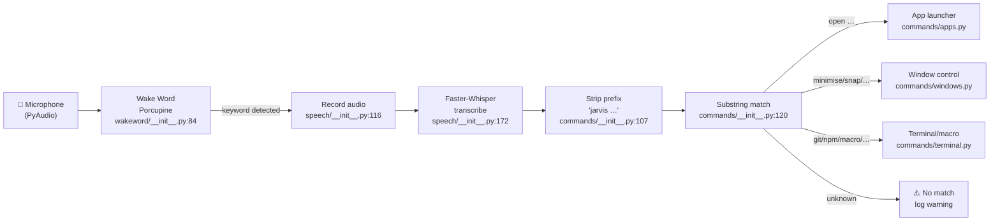

# smartDesktop: current state (baseline)

Written by IBM Bob in task T1 (🔎 SD Analyst), against commit `992e4dc` (tag `baseline-before`).
See [SOURCE.md](SOURCE.md). Every claim cites the source as `file.py:line`.

## Architecture

The assistant is a single Python process with two active threads at runtime: the **main thread**
(which blocks in `SmartDesktopAssistant.run()`) and a daemon **WakeWordThread** that continuously
reads microphone audio and calls back onto itself when the wake word fires. Speech recognition
then happens synchronously inside that same callback before the detection loop resumes.

### Config loading

`main.py:90` defines `_load_config(path)` which calls `yaml.safe_load()` on the YAML file and
returns the raw `dict`. There is no schema validation, no environment-variable substitution for
arbitrary keys, and no merging with defaults — every missing key is handled by `.get("key",
default)` at the use site. The one exception is the Porcupine access key: `main.py:138` calls
`os.path.expandvars(access_key)` so that a value like `"${PORCUPINE_ACCESS_KEY}"` is expanded at
startup. If the key is still the literal placeholder `"YOUR_PORCUPINE_ACCESS_KEY"` the process
exits immediately (`main.py:140`).

### Runtime pipeline

```
main() → _load_config() → SmartDesktopAssistant.__init__()
           │
           ├─ SpeechRecognizer(speech_cfg)         [speech/__init__.py:38]
           │    └─ WhisperModel loaded eagerly at import time
           └─ CommandParser(config)                [commands/__init__.py:37]
                ├─ build_app_commands(apps_cfg)    [commands/apps.py:178]
                ├─ build_window_commands()         [commands/windows.py:273]
                └─ build_terminal_commands(        [commands/terminal.py:176]
                       projects_cfg, macros_cfg)
```

### Steady-state (after init)

```
WakeWordThread (daemon)          Main thread
────────────────────             ───────────
_detection_loop()                while not _shutdown_event:
  ↓ read frame from mic              time.sleep(0.1)
  ↓ porcupine.process(pcm)
  if result >= 0:
    on_detected(keyword)         ← callback runs on WakeWordThread
      _recognizer.listen()
        _record() → pyaudio mic
        _transcribe() → Whisper
      parser.execute(transcript)
        _strip_prefix()
        _match() → handler()
```

### Mermaid flowchart



### Threading detail

| Thread | Name | Daemon | Role |
|---|---|---|---|
| Main | `MainThread` | No | Holds the `while` loop in `SmartDesktopAssistant.run()` (`main.py:164`) |
| Wake word | `WakeWordThread` | Yes (`wakeword/__init__.py:123`) | Runs `_detection_loop()`, fires callback, and blocks through recording + transcription on the same thread |

Because the `on_detected` callback runs on the WakeWordThread (`wakeword/__init__.py:100`), the
detection loop is blocked during the entire record+transcribe+execute cycle. If the callback
raises, `wakeword/__init__.py:103` catches and logs it, then continues the loop.

---

## Command catalog

### Built-in app commands (`commands/apps.py:191`)

| Phrase | Handler (file.py:line) | What it does | Config key |
|---|---|---|---|
| `open chrome` | `apps.py:67` | Launch Google Chrome | — |
| `open firefox` | `apps.py:77` | Launch Mozilla Firefox | — |
| `open terminal` | `apps.py:87` | Open system terminal | — |
| `open vscode` | `apps.py:97` | Open VS Code (`code`) | — |
| `open vs code` | `apps.py:97` | Alias → `open_vscode` | — |
| `open code` | `apps.py:97` | Alias → `open_vscode` | — |
| `open file manager` | `apps.py:102` | Open file manager | — |
| `open explorer` | `apps.py:102` | Alias → `open_file_manager` | — |
| `open calculator` | `apps.py:112` | Open calculator | — |
| `open spotify` | `apps.py:122` | Launch Spotify | — |
| `open discord` | `apps.py:154` | Launch Discord | — |
| `open slack` | `apps.py:163` | Launch Slack | — |
| `open new window` | `apps.py:204` | Alias → `open_chrome` | — |
| `play liked songs` | `apps.py:144` | Spotify liked songs URI | — |
| `play my liked songs` | `apps.py:144` | Alias → liked songs | — |
| `spotify liked songs` | `apps.py:144` | Alias → liked songs | — |
| `open liked songs` | `apps.py:144` | Alias → liked songs | — |

### Config-driven app commands (`commands/apps.py:212`)

Generated at startup from `config.yaml → commands.apps`. Each entry `name: path` registers the phrase `"open <name>"`.

| Phrase (from default config.yaml) | Handler | What it does | Config key |
|---|---|---|---|
| `open league` | `apps.py:217` (lambda closure) | Launch `C:/Riot Games/LeagueClient.exe` | `commands.apps.league` |
| `open discord` | `apps.py:217` (lambda closure) | Launch Discord via Update.exe | `commands.apps.discord` |

> **Note**: `open discord` is also a built-in. The config-driven entry is registered **after**
> the built-in (`commands/__init__.py:48`) and therefore **overwrites** it in `self._commands`.
> The config path wins.

### Built-in window commands (`commands/windows.py:275`)

| Phrase | Handler (file.py:line) | What it does |
|---|---|---|
| `minimise window` | `windows.py:91` | Minimise window matching `""` (always uses first result from `getWindowsWithTitle("")`) |
| `minimize window` | `windows.py:91` | US-spelling alias |
| `maximise window` | `windows.py:106` | Maximise matching window |
| `maximize window` | `windows.py:106` | US-spelling alias |
| `restore window` | `windows.py:121` | Restore matching window |
| `close window` | `windows.py:136` | Close matching window |
| `snap left` | `windows.py:166` | Win+Left hotkey (Windows only) |
| `snap right` | `windows.py:177` | Win+Right hotkey (Windows only) |
| `swap monitors` | `windows.py:188` | Rotate all windows across monitors (Windows only) |
| `switch monitors` | `windows.py:188` | Alias → `swap_monitors` |
| `extend displays` | `windows.py:256` | `DisplaySwitch.exe /extend` (Windows only) |
| `extend monitors` | `windows.py:256` | Alias → `extend_displays` |

### Built-in terminal commands (`commands/terminal.py:190`)

| Phrase | Handler (file.py:line) | What it does |
|---|---|---|
| `git status` | `terminal.py:114` | Run `git status` in new terminal |
| `show git status` | `terminal.py:114` | Alias |
| `git pull` | `terminal.py:119` | Run `git pull` in new terminal |
| `pull latest` | `terminal.py:119` | Alias |
| `run start` | `terminal.py:124` | Run `npm start` |
| `start server` | `terminal.py:124` | Alias |
| `run dev` | `terminal.py:129` | Run `npm run dev` |
| `start dev` | `terminal.py:129` | Alias (also a macro name in default config — **macro wins** because it is registered last) |
| `run tests` | `terminal.py:149` | Run `pytest` |
| `run test` | `terminal.py:149` | Alias |
| `npm test` | `terminal.py:134` | Run `npm test` |
| `npm start` | `terminal.py:124` | Alias |
| `npm dev` | `terminal.py:129` | Alias |
| `npm build` | `terminal.py:139` | Run `npm run build` |
| `run build` | `terminal.py:139` | Alias |
| `run python` | `terminal.py:144` | Run `python main.py` |
| `run main` | `terminal.py:144` | Alias |
| `run pytest` | `terminal.py:149` | Alias → `run_tests` |

### Config-driven project commands (`commands/terminal.py:216`)

Each `name: path` entry under `commands.projects` registers `"go to <name>"`.

| Phrase (default config) | Handler | What it does | Config key |
|---|---|---|---|
| `go to littleguy` | `terminal.py:219` (lambda) | `cd ~/repos/littleguy && code .` | `commands.projects.littleguy` |
| `go to smartdesktop` | `terminal.py:219` (lambda) | `cd ~/repos/smartDesktop && code .` | `commands.projects.smartdesktop` |

### Config-driven macro commands (`commands/terminal.py:223`)

Each `phrase: [step, …]` entry under `commands.macros` registers the phrase directly (lowercased).

| Phrase (default config) | Steps | Config key |
|---|---|---|
| `start dev` | `open terminal`, `run npm run dev` | `commands.macros."start dev"` |
| `morning routine` | `open chrome`, `open discord`, `open spotify` | `commands.macros."morning routine"` |

> **Overwrite**: `start dev` is first registered as a built-in alias for `run_npm_dev`
> (`terminal.py:199`), then overwritten by the macro (`terminal.py:232`). The macro version
> (which calls `_run_in_terminal` for each step) **wins** at runtime. Each macro step string is
> passed verbatim to `_run_in_terminal()` — it is **not** dispatched through `CommandParser`.

---

## OS support matrix

Evidence is drawn from the platform branches in each module; "code" means there is an explicit
`if _OS == "Windows"` / `"Darwin"` / `else` branch. "README claims" notes any gap between the
README's cross-platform claim and the code.

| Command group | Windows | macOS | Linux | Notes |
|---|---|---|---|---|
| **App launcher** (`apps.py`) | ✅ | ✅ | ✅ | All three platforms have explicit paths (`apps.py:68–74`). Linux uses the app's binary name on PATH (e.g. `google-chrome`, `firefox`). `open_vscode` calls `code` with `shell=True` on all platforms — works if `code` is on PATH. |
| **File manager** | ✅ `explorer` | ✅ `Finder` | ⚠️ `xdg-open .` | Linux path is `xdg-open .` passed to `shell=True` via `_open_app`. Works only if `xdg-open` is installed (`apps.py:107`). |
| **Spotify** | ✅ (tries two paths + URI fallback) | ✅ | ⚠️ `spotify` binary on PATH | `apps.py:122–141`. The multi-path search is Windows-only. |
| **Snap left / right** | ✅ Win+arrow hotkey | ❌ returns `False` | ❌ returns `False` | `windows.py:166–185` — explicit `if _OS == "Windows"` guard. README claims cross-platform. |
| **Swap / switch monitors** | ✅ pygetwindow + ctypes | ❌ returns `False` | ❌ returns `False` | `windows.py:198` — explicit `if _OS != "Windows": return False`. README calls it "Switches to external display" which is inaccurate; it rotates windows across monitors. |
| **Extend displays** | ✅ `DisplaySwitch.exe /extend` | ❌ returns `False` | ❌ returns `False` | `windows.py:257` — no branch for non-Windows. |
| **Minimise/maximise/restore/close window** | ✅ (pygetwindow) | ⚠️ | ⚠️ | `windows.py:72`: uses `pygetwindow.getWindowsWithTitle`. `pygetwindow` is mainly tested on Windows; macOS support is partial and Linux support is absent from the library. `minimise_window("")` passes an empty string, matching the first available window — not necessarily the active one. |
| **Terminal / shell commands** (`terminal.py`) | ✅ `start cmd /K "…"` | ✅ AppleScript `osascript` | ✅ tries `gnome-terminal`, `xterm`, `konsole`, `x-terminal-emulator` | `terminal.py:43–64`. Linux silently fails if none of the four emulators is found. |
| **Project navigation** (`go to <name>`) | ⚠️ | ✅ | ✅ | `terminal.py:169` passes the path through `shlex.quote` — safe on POSIX. On Windows the `cd <quoted-path> && code .` command string is run with `shell=True` (`start cmd`); `shlex.quote` produces POSIX quoting which `cmd.exe` does not understand. |
| **Macros** | ✅ | ✅ | ✅ | Each step is passed to `_run_in_terminal()` — inherits the per-platform behaviour above. |

**README vs. code discrepancies:**

1. The README lists **"🌍 Cross-platform — Windows, macOS, Linux"** without qualification.
   Snap, swap-monitors, and extend-displays are **Windows-only** in the code.
2. "Jarvis swap monitors" is described as "Switches to external display" in the README example
   table. The code actually rotates all visible windows across the connected monitors
   (`windows.py:188–253`); it does not control display output modes.
3. `minimise window` / `maximize window` etc. are described as acting on "the active window".
   The code passes `title=""` to `_get_window("")` which calls
   `pygetwindow.getWindowsWithTitle("")` — this returns windows whose title **contains the empty
   string**, i.e., all windows. The first match is used, which may not be the active window.

---

## Does it run?

### `cd voice-assistant && python -m pytest tests -v`

Ran with `.venv/bin/python` (Python 3.14.7, pytest 9.1.1):

```
============================= test session starts ==============================
platform darwin -- Python 3.14.7, pytest-9.1.1, pluggy-1.6.0
collected 45 items

tests/test_commands.py::TestBuildAppCommands::test_builtin_commands_present PASSED
tests/test_commands.py::TestBuildAppCommands::test_custom_app_injected PASSED
tests/test_commands.py::TestBuildAppCommands::test_custom_app_tilde_expanded PASSED
tests/test_commands.py::TestBuildAppCommands::test_liked_songs_commands_all_callable PASSED
tests/test_commands.py::TestBuildAppCommands::test_liked_songs_commands_present PASSED
tests/test_commands.py::TestBuildAppCommands::test_no_custom_apps PASSED
tests/test_commands.py::TestOpenApp::test_windows_normalises_forward_slashes PASSED
tests/test_commands.py::TestOpenApp::test_windows_shell_fallback_when_path_not_found PASSED
tests/test_commands.py::TestOpenApp::test_windows_startfile_oserror_returns_false PASSED
tests/test_commands.py::TestOpenApp::test_windows_uses_startfile_for_existing_path PASSED
tests/test_commands.py::TestBuildWindowCommands::test_all_values_callable PASSED
tests/test_commands.py::TestBuildWindowCommands::test_expected_commands_present PASSED
tests/test_commands.py::TestBuildTerminalCommands::test_builtin_commands_present PASSED
tests/test_commands.py::TestBuildTerminalCommands::test_macro_injected PASSED
tests/test_commands.py::TestBuildTerminalCommands::test_project_shortcuts_injected PASSED
tests/test_commands.py::TestCommandParser::test_custom_project_command PASSED
tests/test_commands.py::TestCommandParser::test_exact_match PASSED
tests/test_commands.py::TestCommandParser::test_execute_unknown_returns_false PASSED
tests/test_commands.py::TestCommandParser::test_execute_with_wake_word_prefix PASSED
tests/test_commands.py::TestCommandParser::test_liked_songs_command_matched PASSED
tests/test_commands.py::TestCommandParser::test_no_match PASSED
tests/test_commands.py::TestCommandParser::test_registered_commands_nonempty PASSED
tests/test_commands.py::TestCommandParser::test_registered_commands_sorted PASSED
tests/test_commands.py::TestCommandParser::test_strip_prefix PASSED
tests/test_commands.py::TestCommandParser::test_substring_match PASSED
tests/test_commands.py::TestGetMonitors::test_non_windows_returns_empty PASSED
tests/test_commands.py::TestGetMonitors::test_windows_returns_sorted_monitors PASSED
tests/test_commands.py::TestSwapMonitors::test_minimized_windows_are_skipped PASSED
tests/test_commands.py::TestSwapMonitors::test_non_windows_returns_false PASSED
tests/test_commands.py::TestSwapMonitors::test_single_monitor_returns_false PASSED
tests/test_commands.py::TestSwapMonitors::test_three_monitors_rotates_sequentially PASSED
tests/test_commands.py::TestSwapMonitors::test_two_monitors_moves_windows PASSED
tests/test_commands.py::TestSwapMonitors::test_untitled_windows_are_skipped PASSED
tests/test_speech.py::TestIsCudaError::test_cannot_be_loaded PASSED
tests/test_speech.py::TestIsCudaError::test_cublas_dll_missing PASSED
tests/test_speech.py::TestIsCudaError::test_cuda_generic PASSED
tests/test_speech.py::TestIsCudaError::test_cudnn_missing PASSED
tests/test_speech.py::TestIsCudaError::test_not_cuda_error PASSED
tests/test_speech.py::TestIsCudaError::test_unrelated_runtime_error PASSED
tests/test_speech.py::TestTranscribeCudaFallback::test_fallback_reloads_on_cpu_and_returns_transcript PASSED
tests/test_speech.py::TestTranscribeCudaFallback::test_non_cuda_error_returns_none_without_reload PASSED
tests/test_speech.py::TestTranscribeCudaFallback::test_successful_transcription_no_fallback PASSED
tests/test_speech.py::TestInitCudaFallback::test_init_does_not_fall_back_when_device_is_already_cpu PASSED
tests/test_speech.py::TestInitCudaFallback::test_init_does_not_swallow_non_cuda_errors PASSED
tests/test_speech.py::TestInitCudaFallback::test_init_falls_back_to_cpu_on_cuda_load_error PASSED

============================== 45 passed in 0.38s ==============================
```

**Result: 45 passed, 0 failed, 0 errors.** All hardware dependencies (`pvporcupine`, `pyaudio`,
`faster_whisper`, `pyautogui`, `pygetwindow`) are stubbed out by `test_commands.py:15–44` and
`test_speech.py:15–33` before the project code is imported.

### `python main.py --list-commands`

Running `python main.py --list-commands` **fails** on this machine:

```
Traceback (most recent call last):
  File "main.py", line 215, in main
    assistant = SmartDesktopAssistant(config)
  File "main.py", line 116, in __init__
    from speech import SpeechRecognizer
  File "speech/__init__.py", line 16, in <module>
    import pyaudio
ModuleNotFoundError: No module named 'pyaudio'
```

Root cause: `SmartDesktopAssistant.__init__()` (`main.py:115`) imports `SpeechRecognizer`
unconditionally, which triggers `speech/__init__.py:16` which top-level imports `pyaudio`. The
`--list-commands` path does not need the microphone, but there is no lazy-import guard before it.
`pyaudio` requires PortAudio (a C library) which is not installed in this environment.

With all requirements installed the command would print the sorted list from
`CommandParser.registered_commands` (`commands/__init__.py:99`).

**Expected output (derived from the code with default `config.yaml`):**

```
Registered commands:
  • extend displays
  • extend monitors
  • git pull
  • git status
  • go to littleguy
  • go to smartdesktop
  • maximize window
  • maximise window
  • minimize window
  • minimise window
  • morning routine
  • npm build
  • npm dev
  • npm start
  • npm test
  • open calculator
  • open chrome
  • open code
  • open discord      ← config.yaml value overwrites built-in
  • open explorer
  • open file manager
  • open firefox
  • open league
  • open liked songs
  • open new window
  • open slack
  • open spotify
  • open terminal
  • open vscode
  • open vs code
  • play liked songs
  • play my liked songs
  • pull latest
  • restore window
  • run build
  • run dev
  • run main
  • run pytest
  • run python
  • run start
  • run test
  • run tests
  • show git status
  • snap left
  • snap right
  • spotify liked songs
  • start dev         ← macro overwrites built-in alias
  • start server
  • swap monitors
  • switch monitors
```

### What the real assistant needs to run

| Requirement | What happens without it |
|---|---|
| **Porcupine access key** (free at console.picovoice.ai) | `main.py:140` detects the placeholder and calls `sys.exit(1)` with a clear message |
| **`pvporcupine` Python package** | `wakeword/__init__.py:14` `import pvporcupine` raises `ModuleNotFoundError` at `detector = WakeWordDetector(...)` |
| **PortAudio + `pyaudio`** | `speech/__init__.py:16` raises `ModuleNotFoundError` at `SmartDesktopAssistant.__init__()` — blocks `--list-commands` too |
| **Faster-Whisper model weights** | Downloaded automatically on first use by `faster_whisper`; requires internet on first run |
| **Microphone** | `speech/_init__.py:130` `pa.open(input=True)` raises `OSError` at recording time |
| **CUDA / GPU** (optional) | `speech/__init__.py:78` catches the error and falls back to CPU automatically |
| **`pygetwindow`** (optional) | Window commands log a warning and return `False` (`windows.py:83`); the rest of the assistant keeps working |
| **`pyautogui`** (optional) | Snap commands raise `ImportError` inside `snap_left`/`snap_right` at call time; not caught |
